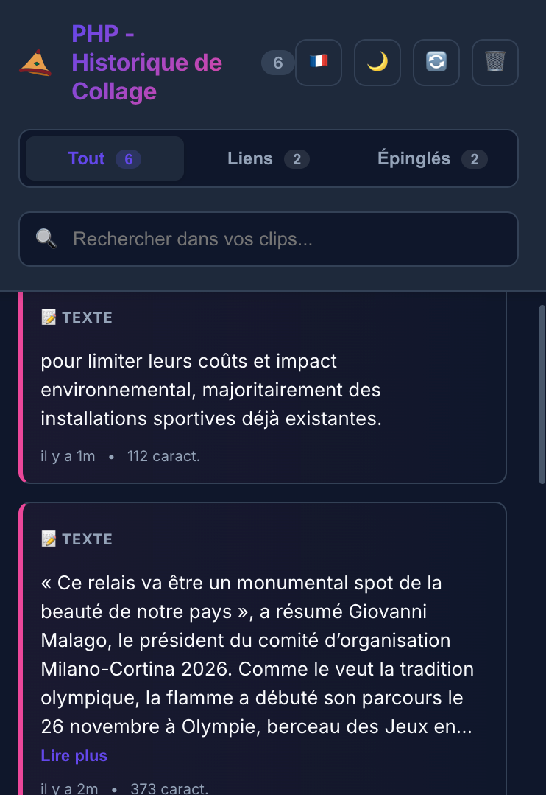
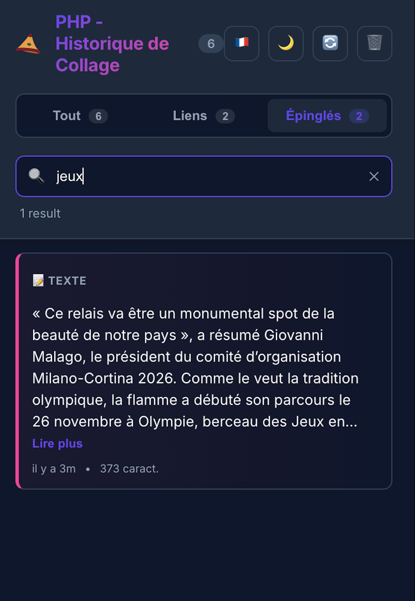
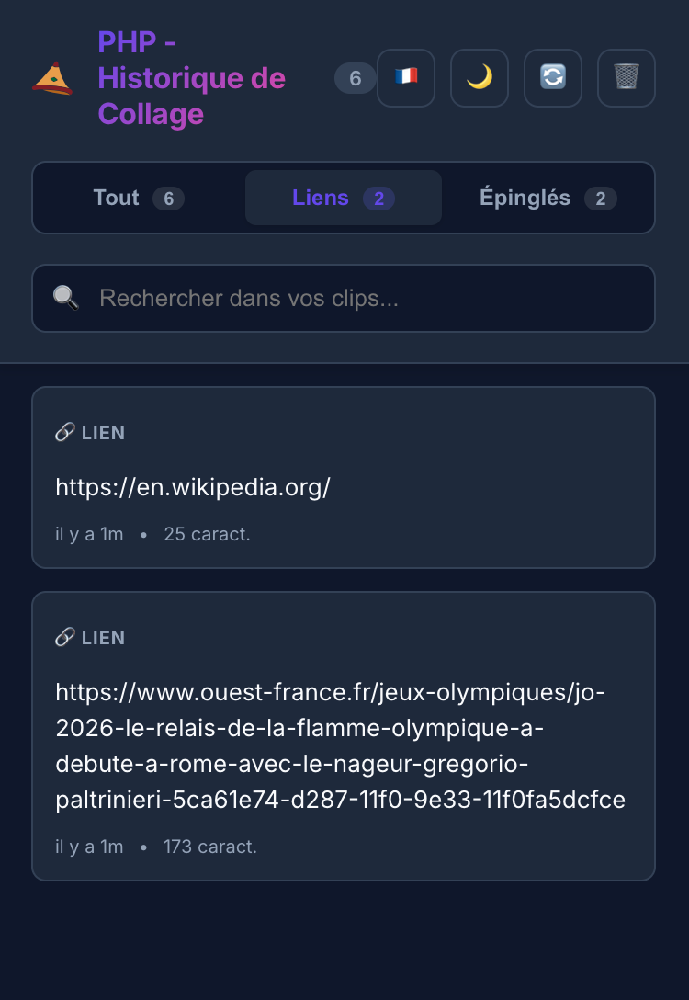
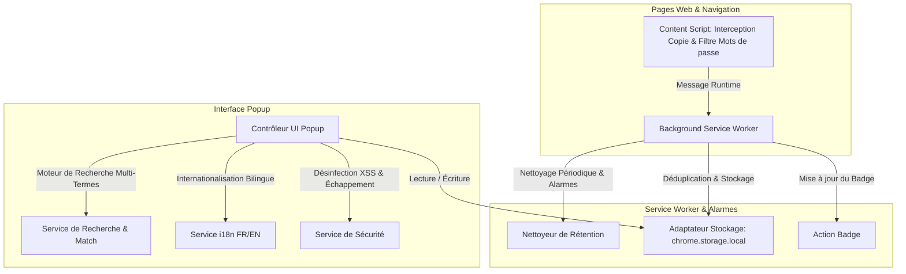

<div align="center">
  
  <br><br>

  <p>
    
    
    
    
    
    
    
  </p>

  <a href="https://chromewebstore.google.com/detail/php-paste-history-past/dfdkpkiehdpbgkoacggbglphnlghmapl?hl=fr&pli=1">
    
  </a>

  <h1>⚡ PHP - Historique de Collage ⚡</h1>
  <p><strong>Sécurisé. Local. Ultra-Rapide.</strong><br>Le gestionnaire d'historique de presse-papiers moderne et respectueux de votre vie privée.</p>
</div>

---

<div align="center">
  <h2>⚡ Ne perdez plus jamais un texte copié. ⚡</h2>
  
</div>

<br>

# 🚀 Fonctionnalités

| Fonctionnalité | Description |
| :--- | :--- |
| **📋 Historique Multi-Catégories** | Enregistrement automatique et classification intelligente en **💻 Code**, **🔗 Liens** et **📝 Texte**. |
| **🔍 Recherche Multi-Termes** | Recherche instantanée en mémoire avec surbrillance dynamique des mots-clés dans les textes et URLs. |
| **📌 Épinglage Permanent** | Verrouillez les clips importants pour les conserver indéfiniment sans risque de suppression automatique. |
| **👁️ Mode Lecture (Reader Mode)** | Modale de prévisualisation monospace pour lire les longs scripts, requêtes SQL ou articles jusqu'à **20 000 caractères**. |
| **🛡️ Protection des Mots de Passe** | Ignorance automatique des copies provenant des champs sensibles (`<input type="password">`, formulaires d'authentification). |
| **📦 Sauvegarde & Restauration JSON** | Exportez et restaurez l'intégralité de votre historique et de vos préférences en un clic via un fichier JSON standard. |
| **🌐 Bilingue (EN / FR)** | Détection automatique de la langue du navigateur et bascule instantanée Français / Anglais. |
| **🌑 Thèmes Sombre & Clair** | Interface épurée au design glassmorphism s'adaptant parfaitement à vos préférences de confort visuel. |
| **🔒 100% Local & Hors-ligne** | **Zéro** requête réseau. **Zéro** analytique. Vos données restent exclusivement sur votre appareil. |

---

# 📸 Visite Guidée

<div align="center">
  <h3>1️⃣ Le Centre de Commandement</h3>
  <p><em>Accédez à l'ensemble de vos clips avec classification instantanée, compteurs de copie et actions rapides.</em></p>
  
</div>

<table border="0" width="100%">
  <tr>
    <td width="50%" valign="top">
      <h3 align="center">🔍 Recherche Instantanée</h3>
      <p align="center">Filtrage multi-mots en quelques millisecondes avec mise en valeur des correspondances.</p>
      
    </td>
    <td width="50%" valign="top">
      <h3 align="center">🔗 Détection de Liens</h3>
      <p align="center">Isole automatiquement les URLs, extrait les domaines et affiche les favicons officiels.</p>
      
    </td>
  </tr>
  <tr>
    <td width="50%" valign="top">
      <br>
      <h3 align="center">👁️ Mode Lecture</h3>
      <p align="center">Lisez le contenu complet (articles, code) sans avoir à coller.</p>
      
    </td>
    <td width="50%" valign="top">
      <br>
      <h3 align="center">📌 Favoris Épinglés</h3>
      <p align="center">Verrouillez les clips importants pour éviter leur suppression auto.</p>
      
    </td>
  </tr>
</table>

---

# 🏗️ Architecture & Standards d'Ingénierie



---

# ⌨️ Raccourcis Clavier

| Raccourci | Action |
| :--- | :--- |
| <kbd>Cmd</kbd> + <kbd>Shift</kbd> + <kbd>V</kbd> *(Mac)* | Ouvrir l'historique PHP |
| <kbd>Alt</kbd> + <kbd>V</kbd> *(Windows / Linux)* | Ouvrir l'historique PHP |
| <kbd>Ctrl</kbd> / <kbd>Cmd</kbd> + <kbd>F</kbd> | Activer la barre de recherche |
| <kbd>Entrée</kbd> ou <kbd>Espace</kbd> | Copier le clip sélectionné |
| <kbd>Échap</kbd> | Fermer la modale d'aperçu ou des paramètres |

---

# 🧪 Tests Automatisés & Assurance Qualité

Le projet dispose d'une suite de tests complète avec **51 tests automatisés validés (100% de succès)** et plus de **95.8% de couverture métier** :

```bash
# Lancer les tests unitaires, d'intégration et d'interface
npm test

# Générer le rapport de couverture de code
npm run test:coverage

# Vérifier les types TypeScript
npm run type-check

# Compiler le bundle de production
npm run build

# Générer l'archive release .zip pour le Store
npm run package
```

---

# 📦 Installation

### Depuis le Chrome Web Store
Installez directement l'extension validée depuis le [Chrome Web Store](https://chromewebstore.google.com/detail/php-paste-history-past/dfdkpkiehdpbgkoacggbglphnlghmapl?hl=fr&pli=1).

### Installation Développeur (Extension non empaquetée)
1. Clonez ce dépôt :
   ```bash
   git clone https://github.com/fnnktkygl-code/php-chrome-extension.git
   cd php-chrome-extension
   ```
2. Installez les dépendances et compilez :
   ```bash
   npm install
   npm run build
   ```
3. Ouvrez Chrome et rendez-vous sur `chrome://extensions/`.
4. Activez le **Mode développeur** (en haut à droite).
5. Cliquez sur **Charger l'extension non empaquetée** et sélectionnez le dossier `dist/`.

---

<div align="center">
  <p>Développé avec ❤️ par <strong>Fnnk</strong></p>
  <p>Open Source sous <strong>Licence MIT</strong></p>
</div>