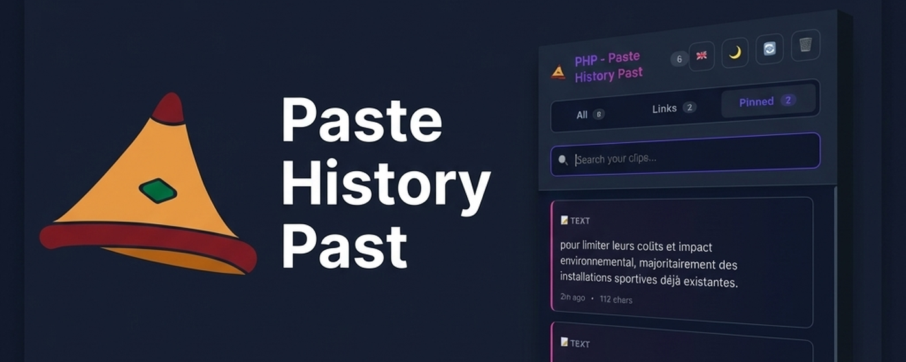
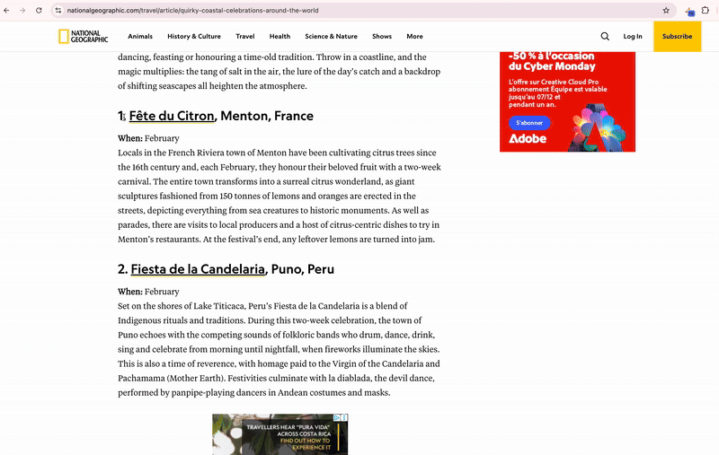
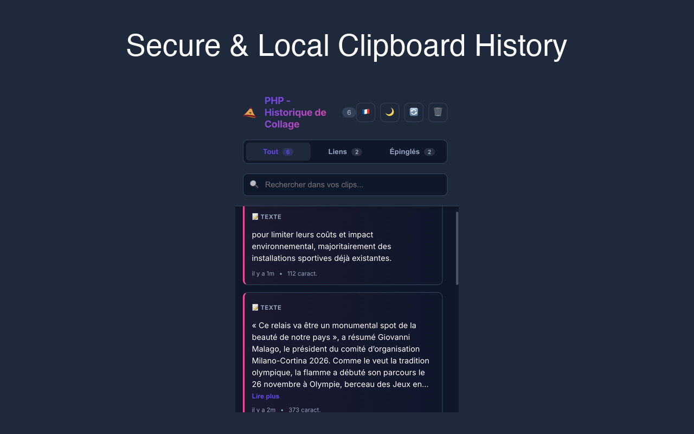
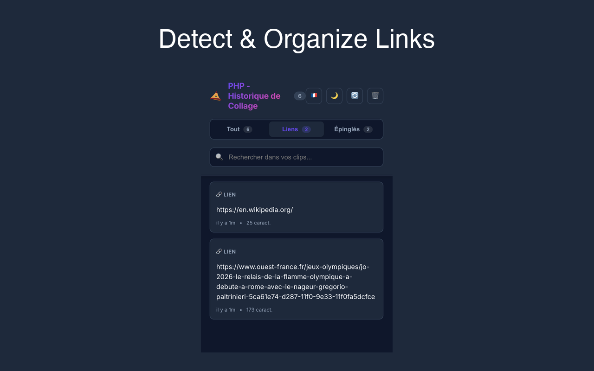
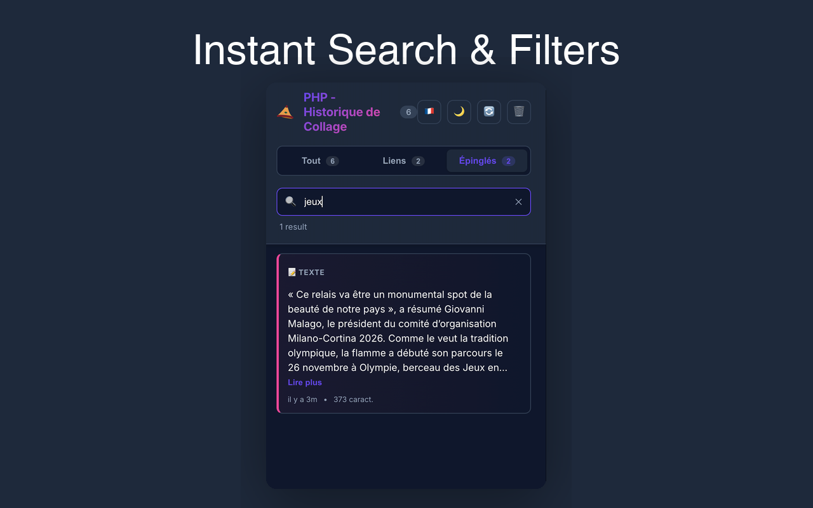
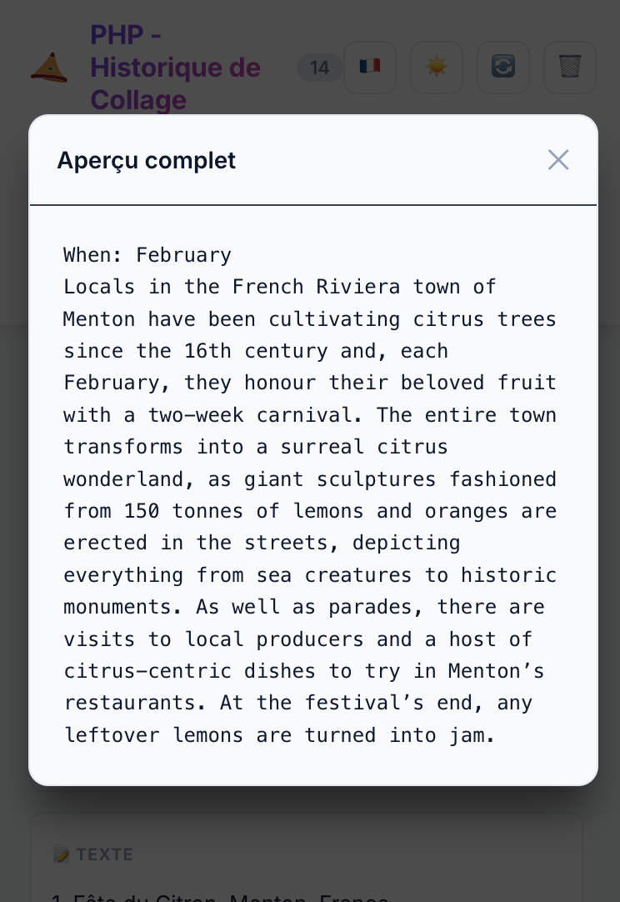
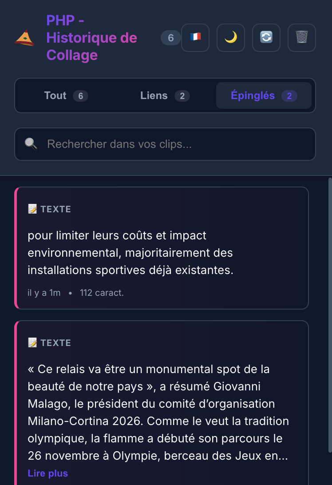
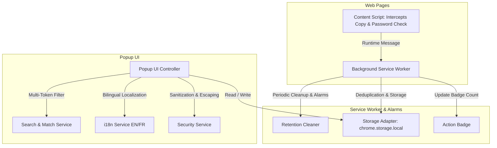

<div align="center">
  
  <br><br>

  <p>
    
    
    
    
    
    
    
  </p>

  <a href="https://chromewebstore.google.com/detail/php-paste-history-past/dfdkpkiehdpbgkoacggbglphnlghmapl?hl=fr&pli=1">
    
  </a>

  <h1>⚡ PHP - Paste History Past ⚡</h1>
  <p><strong>Secure. Local. Ultra-Fast.</strong><br>The modern, privacy-first clipboard history manager for Google Chrome.</p>
</div>

---

<div align="center">
  <h2>⚡ Never lose copied text again. ⚡</h2>
  
</div>

<br>

# 🚀 Features

| Feature | Description |
| :--- | :--- |
| **📋 Smart Multi-Type History** | Automatically saves your copied items with intelligent categorization into **💻 Code**, **🔗 Links**, and **📝 Text**. |
| **🔍 Multi-Token Instant Search** | Fast in-memory search highlighting matching keywords across clip contents and source URLs. |
| **📌 Permanent Pinning** | Pin essential clips, commands, and notes forever—immune to automated retention pruning. |
| **👁️ Reader / Preview Mode** | Monospace reader modal to preview long scripts, SQL queries, or articles up to **20,000 characters**. |
| **🛡️ Password & Sensitive Shield** | Automatically ignores copies from `<input type="password">`, auth forms, and sensitive input fields. |
| **📦 JSON Backup & Restore** | Export and import your complete clipboard history and custom configurations with one click. |
| **🌐 Bilingual (EN / FR)** | Native English and French support with automatic browser language detection and instant switcher. |
| **🌑 Dark & Light Themes** | Premium glassmorphic interface that seamlessly adapts to your preferences. |
| **🔒 100% Local & Offline** | **Zero** external network requests. **Zero** telemetry. Your data never leaves your machine. |

---

# 📸 Visual Tour

<div align="center">
  <h3>1️⃣ The Command Center</h3>
  <p><em>Access your full history with instant categorization, copy counts, and one-click actions.</em></p>
  
</div>

<br>

<table border="0" width="100%">
  <tr>
    <td width="50%" valign="top">
      <h3 align="center">🔗 Smart Link Detection</h3>
      <p align="center">Automatically detects URLs, cleans domains, and displays rich favicon cards.</p>
      
    </td>
    <td width="50%" valign="top">
      <h3 align="center">🔍 Instant Search & Highlight</h3>
      <p align="center">Search across text and domains with multi-token keyword highlighting.</p>
      
    </td>
  </tr>
  <tr>
    <td width="50%" valign="top">
      <br>
      <h3 align="center">👁️ Code & Text Reader</h3>
      <p align="center">Monospace preview modal with instant copy button and ESC shortcut.</p>
      
    </td>
    <td width="50%" valign="top">
      <br>
      <h3 align="center">📌 Pinned Favorites</h3>
      <p align="center">Lock critical clips to keep them permanently in your local history.</p>
      
    </td>
  </tr>
</table>

---

# 🏗️ Architecture & Engineering Standards



### Module Structure

```
src/
├── domain/                  # Pure domain types, constants, and validation rules
│   └── types.ts             # Clip, Settings, FilterMode, RuntimeMessage definitions
├── application/             # Business logic & services
│   ├── clipboard.service.ts # Deduplication, FIFO eviction, pinning, copy counters
│   ├── storage.service.ts   # Typed storage abstraction & JSON backup exporter/importer
│   ├── search.service.ts    # URL & code detectors, domain extractor, query highlighter
│   ├── security.service.ts  # HTML escaping, sensitive input detector, length bounds
│   └── i18n.service.ts      # Bilingual localization dictionary & relative time formatter
├── infrastructure/          # Adapters and test mocks
│   └── mock-chrome.ts       # Full in-memory Chrome API mock for test suites
├── background/              # Manifest V3 service worker & lifecycle alarms
├── content/                 # Secure content script with password isolation
└── popup/                   # Modern popup interface & CSS tokens
```

---

# ⌨️ Keyboard Shortcuts

| Shortcut | Action |
| :--- | :--- |
| <kbd>Cmd</kbd> + <kbd>Shift</kbd> + <kbd>V</kbd> *(Mac)* | Open PHP Clipboard History |
| <kbd>Alt</kbd> + <kbd>V</kbd> *(Windows / Linux)* | Open PHP Clipboard History |
| <kbd>Ctrl</kbd> / <kbd>Cmd</kbd> + <kbd>F</kbd> | Focus Search Bar |
| <kbd>Enter</kbd> or <kbd>Space</kbd> | Copy selected clip |
| <kbd>Esc</kbd> | Close Reader Preview / Settings Modal |

---

# 🧪 Automated Testing & Quality Assurance

PHP includes an exhaustive automated test suite with **51 automated tests (100% pass rate)** and **95.8% domain coverage**:

```bash
# Run unit, integration, and UI tests
npm test

# Run test coverage report
npm run test:coverage

# Run TypeScript static type-checking
npm run type-check

# Build optimized production bundle
npm run build

# Package release .zip archive
npm run package
```

---

# 📦 Installation

### From Chrome Web Store
Install the verified release directly from the [Chrome Web Store](https://chromewebstore.google.com/detail/php-paste-history-past/dfdkpkiehdpbgkoacggbglphnlghmapl?hl=fr&pli=1).

### Developer Installation (Load Unpacked)
1. Clone this repository:
   ```bash
   git clone https://github.com/fnnktkygl-code/php-chrome-extension.git
   cd php-chrome-extension
   ```
2. Install dependencies & build:
   ```bash
   npm install
   npm run build
   ```
3. Open Chrome and navigate to `chrome://extensions/`.
4. Enable **Developer mode** (top right switch).
5. Click **Load unpacked** and select the `dist/` directory.

---

# 🔒 Security & Privacy Policy

- **Zero Cloud**: Copied data is stored strictly in `chrome.storage.local`.
- **Zero Telemetry**: No analytics or remote calls whatsoever.
- **Zero Password Capture**: Password fields are strictly ignored.
- Read our full [Security Policy](SECURITY.md) and [Privacy Policy](PRIVACY_POLICY.md).

---

<div align="center">
  <p>Crafted with ❤️ by <strong>Fnnk</strong></p>
  <p>Open Source under the <strong>MIT License</strong></p>
</div>