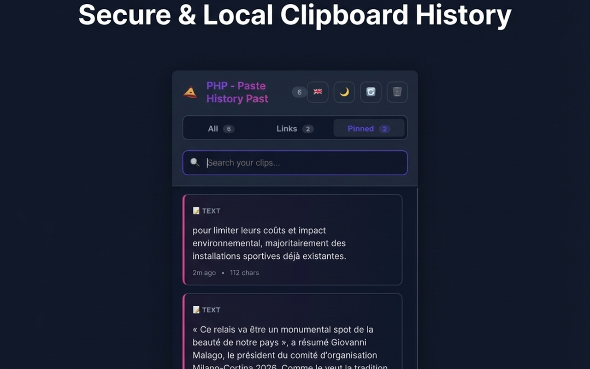
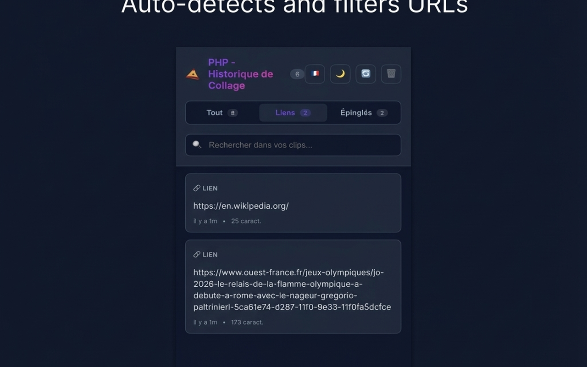
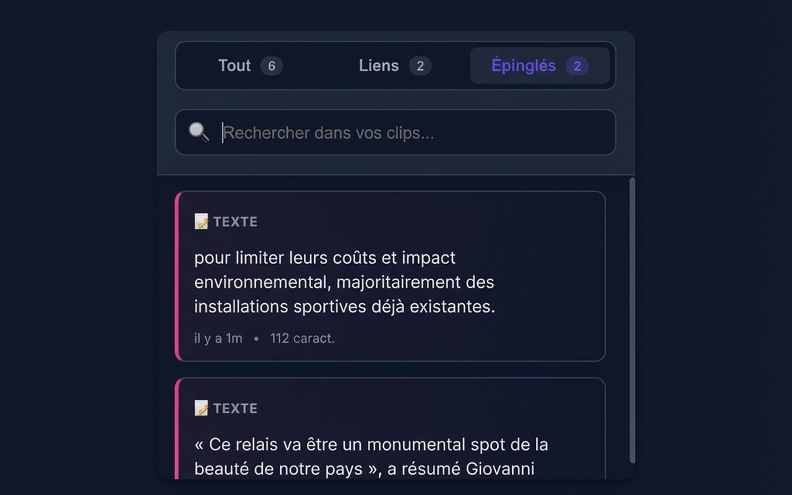

<h1 align="center">✨ PHP - Paste History Past - Chrome Extension</h1>

  
  
  
  

  A minimal, modern, and privacy-first Chrome extension to track and quickly access your paste history. 
  <strong>Never lose copied text again!</strong>

  

  
  &nbsp;
  

---

## 🚀 Features

-   **Clipboard History** — Automatically saves your last **50** copied texts (up to 20,000 characters each).
-   **Smart Capture** — Robustly captures text from webpages and input fields.
-   **Instant Access** — Open the popup with a click or use the keyboard shortcut `Alt+V` (Windows/Linux) or `Cmd+Shift+V` (Mac).
-   **Powerful Filtering** — Instantly search or filter by *All*, *Links*, or *Pinned* items.
-   **Pin Important Clips** — Keep your favorite clips forever (they won't be auto-deleted).
-   **Light & Dark Mode** — Beautiful, premium UI that adapts to your preference.
-   **Auto-Cleanup** — Unpinned clips are automatically removed after **24 hours** to keep things clean.
-   **Multi-language** — Supports English and French.

---

## � Privacy & Security (What it DOES NOT do)

Your privacy is the **top priority**. We believe your clipboard data belongs to you.

-   ❌ **NO External Servers**: We do not have any servers. We cannot see your data.
-   ❌ **NO Tracking**: No analytics, no telemetry, no user tracking.
-   ❌ **NO Network Requests**: The extension never makes a network request to the internet.
-   ✅ **100% Local Storage**: All data is stored securely on your device using `chrome.storage.local`.

---

## 📦 Installation

### From Chrome Web Store
*(Link coming soon)*

### Manual Installation (Developer Mode)
1.  **Download** the latest release or clone this repository.
2.  Open Chrome and navigate to `chrome://extensions/`.
3.  Enable **Developer Mode** (top right).
4.  Click **Load unpacked** and select the extension folder.

---

## 🎯 Usage

-   **Copy Text:** Simply copy text (`Cmd+C` / `Ctrl+C`) as usual.
-   **Open Popup:** Click the extension icon or press `Cmd+Shift+V` (Mac) / `Alt+V` (Win).
-   **Copy Back:** Click any item in the list to copy it back to your clipboard.
-   **Pin:** Click the 📌 icon to save a clip indefinitely.
-   **Delete:** Click the �️ icon to remove a clip.

---

## 🛠️ Built With

-   **Manifest V3** — Compliant with the latest Chrome extension security standards.
-   **Vanilla JavaScript** — Lightweight and fast, no heavy frameworks.
-   **Modern CSS** — Uses CSS Variables and Flexbox for a premium, responsive UI.

---

## 📄 License

This project is licensed under the **MIT License**.

---

  Made with ❤️ by Njm <a href="https://github.com/fnnktkygl-code">Fnnk</a>

