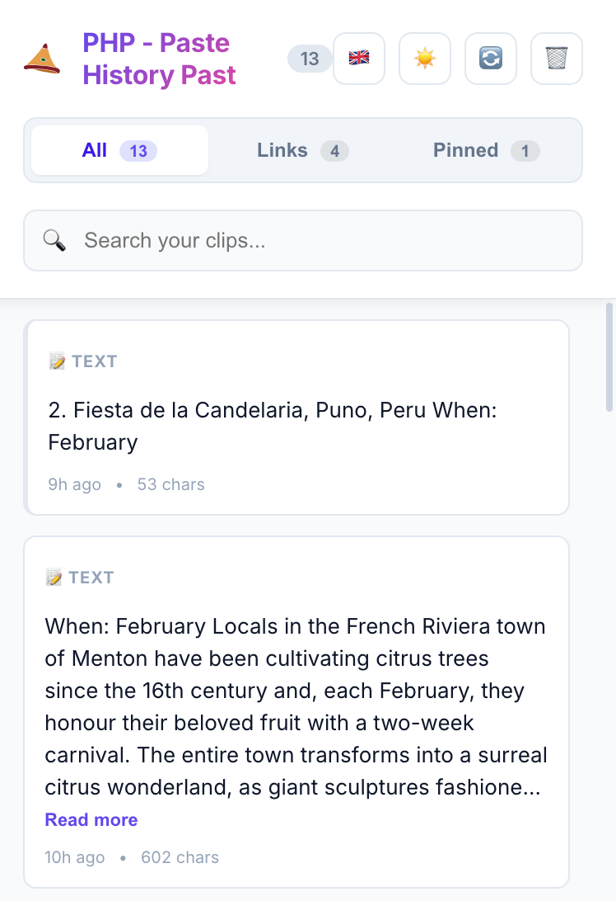
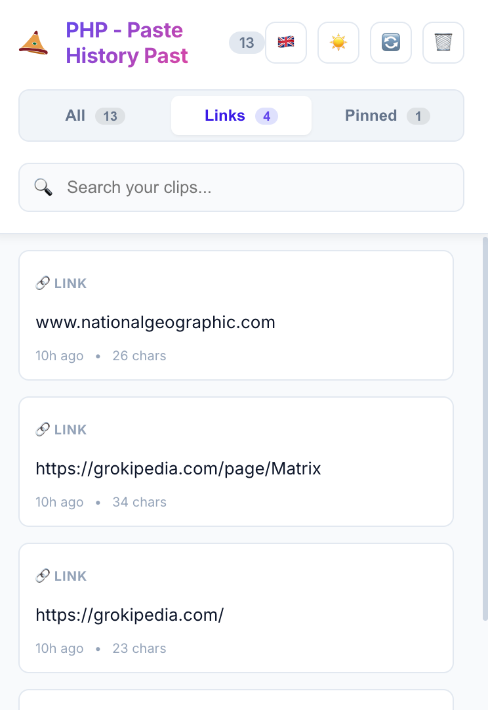
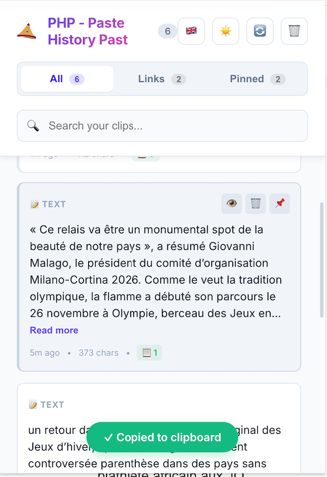
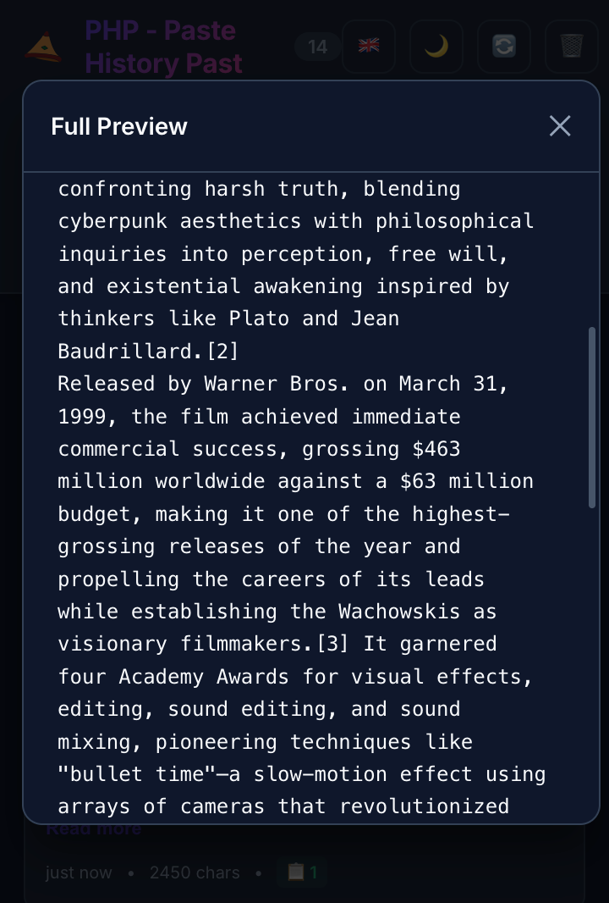
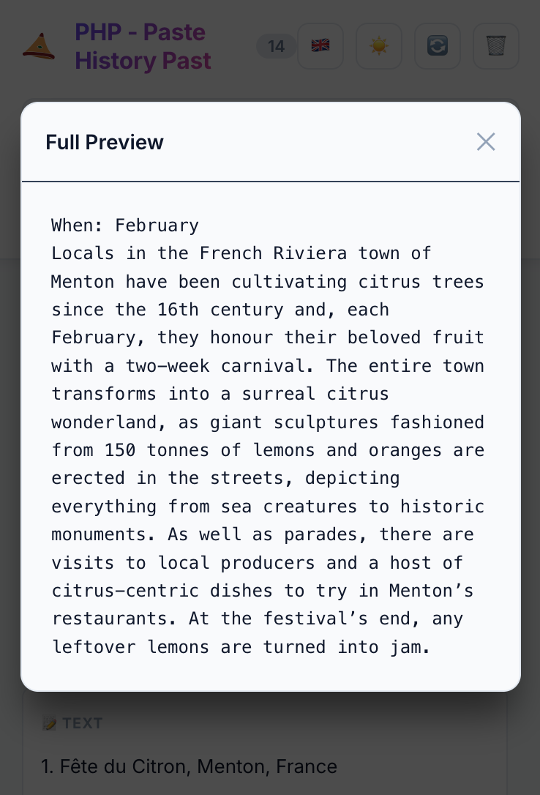

  

    

  

    
    
    
    
  

  <h1>⚡ PHP - Paste History Past ⚡</h1>
  
<strong>Secure. Local. Efficient.</strong> The clipboard manager that respects your privacy.

---

# 🚀 Features at a Glance

| Feature | Description |
| :--- | :--- |
| **📋 Infinite History** | Automatically saves your last **50** copied items locally. |
| **🎨 Dark & Light Mode** | Fully adaptive UI that matches your system preference. |
| **🔍 Smart Search** | Instantly filter clips to find snippets from hours ago. |
| **🔗 Link Detector** | Separates URLs from text so you can find web resources fast. |
| **📌 Pin & Save** | Keep important items forever; prevent auto-deletion. |
| **🛡️ Privacy First** | **Zero** analytics. **Zero** network requests. 100% Local. |

---

# 📸 Visual Tour

  <h3>The Command Center</h3>
  
<em>Access your history, filter by type, and manage clips in one clean interface.</em>

  

<table border="0" width="100%">
  <tr>
    <td width="50%" valign="top">
      <h3 align="center">🔗 Smart Link Detection</h3>
      
Auto-detects URLs. Filter by "Links" to find websites.

      
    </td>
    <td width="50%" valign="top">
      <h3 align="center">⚡ One-Click Copy</h3>
      
Click any item to copy. Instant visual feedback.

      
    </td>
  </tr>
  <tr>
    <td width="50%" valign="top">
       
      <h3 align="center">🌑 Dark Mode Preview</h3>
      
Seamless dark theme support for night-time productivity.

      
    </td>
    <td width="50%" valign="top">
       
      <h3 align="center">👁️ Reader Mode</h3>
      
Preview long content like code or articles without pasting.

      
    </td>
  </tr>
</table>

---

# 🔒 Privacy & Security

We take privacy seriously. **PHP - Paste History Past** is designed to be completely isolated.

* ✅ **100% Local Storage**: Copied text is stored only in `chrome.storage.local`.
* ❌ **No Analytics**: We don't know who you are or what you copy.
* ❌ **No External Servers**: This extension has no backend.
* ❌ **No Network Activity**: It simply does not connect to the internet.

---

# 📦 Installation

### From Chrome Web Store
*(Link Coming Soon)*

### Manual Installation (Developer Mode)
1.  **Download** the latest release or clone this repo.
2.  Open Chrome and navigate to `chrome://extensions/`.
3.  Toggle **Developer Mode** (top right switch).
4.  Click **Load unpacked** and select the folder containing this extension.

---

# 🎯 Usage Shortcuts

* **Copy**: `Cmd+C` or `Ctrl+C` (Standard)
* **Open PHP**: `Cmd+Shift+V` (Mac) or `Alt+V` (Win/Linux)
* **Paste**: Click any item in the list to copy it back to your clipboard.

---

  
Made with ❤️ by <strong>Fnnk</strong>

  
Open Source under MIT License

